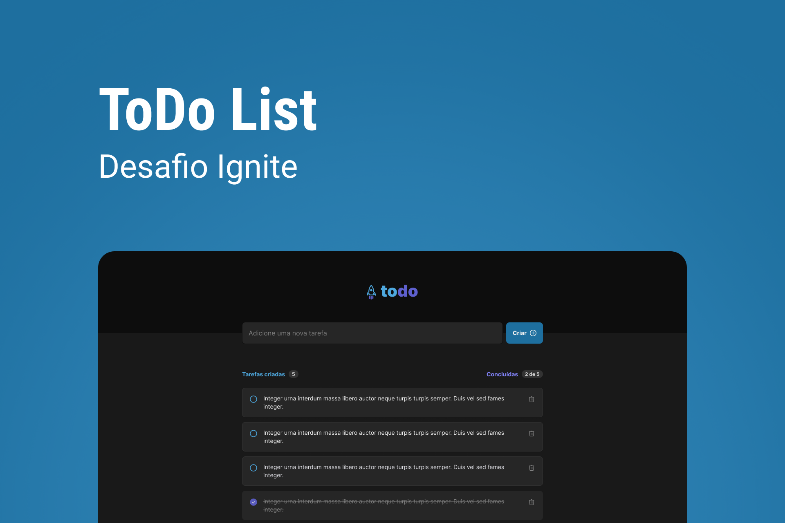

<div align="center">

<h1> ToDo List </h1>
</div>

<p align="center">
Aplicativo de ToDo List desenvolvido durante a Trilha ReactJS do Ignite na Rocketseat <br/>
<a href="https://www.rocketseat.com.br/ignite">Saiba mais sobre o Ignite clicando aqui.</a>
</p>

<p align="center">
  <a href="#-tecnologias">Tecnologias</a>&nbsp;&nbsp;&nbsp;|&nbsp;&nbsp;&nbsp;
  <a href="#-projeto">Projeto</a>&nbsp;&nbsp;&nbsp;|&nbsp;&nbsp;&nbsp;
  <a href="#-layout">Layout</a>&nbsp;&nbsp;&nbsp;|&nbsp;&nbsp;&nbsp;
  <a href="#-instalação">Instalação</a>&nbsp;&nbsp;&nbsp;|&nbsp;&nbsp;&nbsp;
  <a href="#memo-licença">Licença</a>&nbsp;&nbsp;&nbsp;|&nbsp;&nbsp;&nbsp;
</p>

<p align="center">
  
</p>

<br>

<p align="center">
  
</p>

## 🚀 Tecnologias

Esse projeto foi desenvolvido com as seguintes tecnologias:

- Javascript
- Typescript
- ReactJS
- ViteJS
- CSS Module
- Figma
- Vercel

## 💻 Projeto

O ToDo List é um aplicativo onde pode ser criado tarefas, marcar as tarefas como concluídas ou excluir alguma tarefa. <br/>
Esse é o primeiro desafio desenvolvido durante a Trilha Ignite de ReactJS.

- [Acesse o deploy do projeto, na Vercel](https://florenciomath-todolist.vercel.app/)


## 🔖 Layout

Você pode visualizar o layout do projeto através [DESSE LINK](https://www.figma.com/file/0n0zDN7zbzhRbaEO74Xesx/ToDo-List/duplicate?node-id=0%3A1). É necessário ter conta no [Figma](https://figma.com) para acessá-lo.


## 🪛 Instalação 

### Pré-requisitos

* npm
```sh
 npm install npm@latest -g
````

### Instalação

1. Clone o repositório
```sh
https://github.com/florencioMath/Challenge-Ignite-TodoList.git
```
2. Entre na pasta e instale as dependências
```sh
$ cd todoList
$ npm install
```
3. Inicie o projeto
```sh
$ npm run dev
```
4. Abra no navegador 
```txt
http://localhost:5173/
```

## :memo: Licença

Esse projeto está sob a licença MIT.

---

Feito com 🖤 by Matheus Florêncio :wave:
